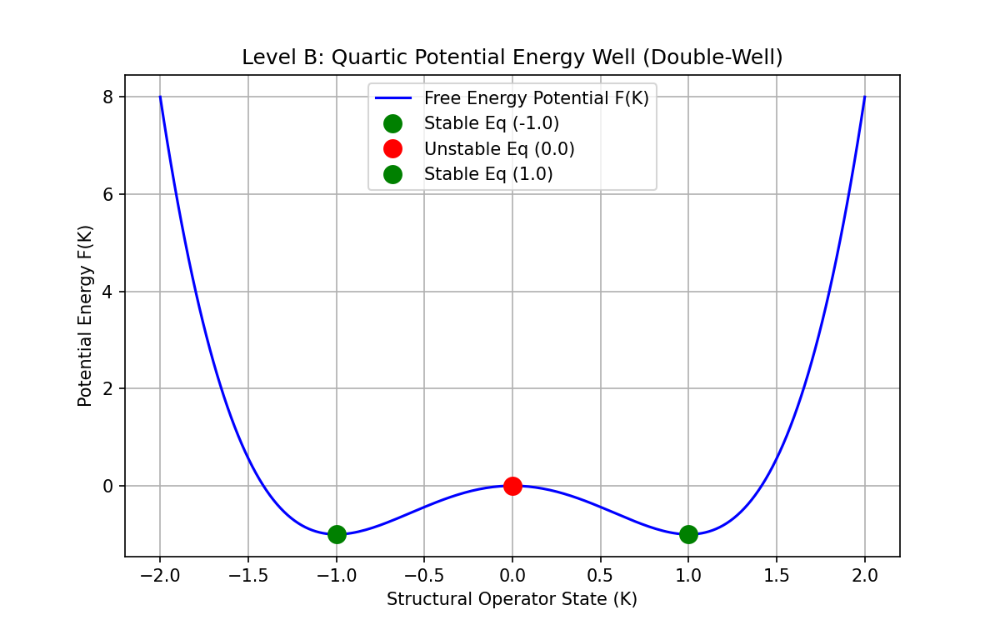
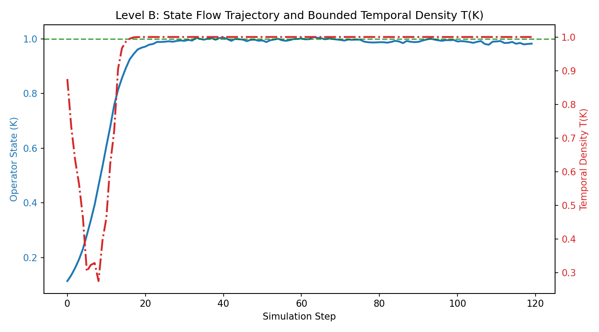
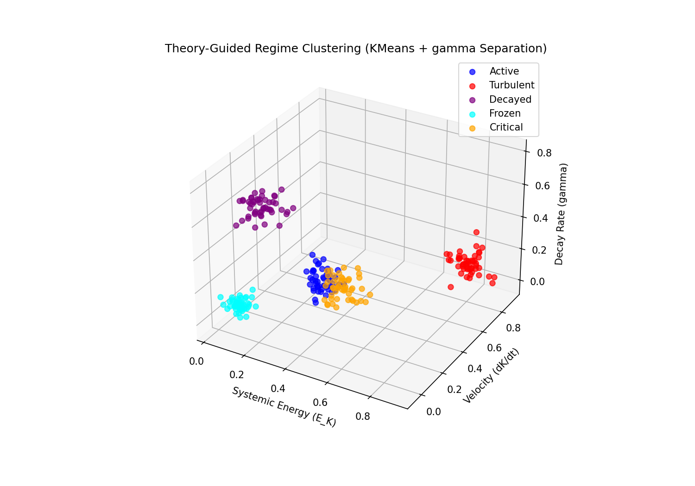
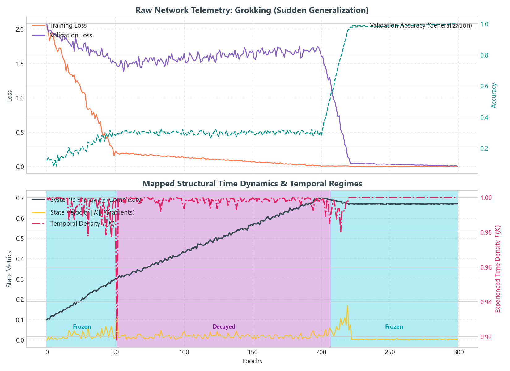
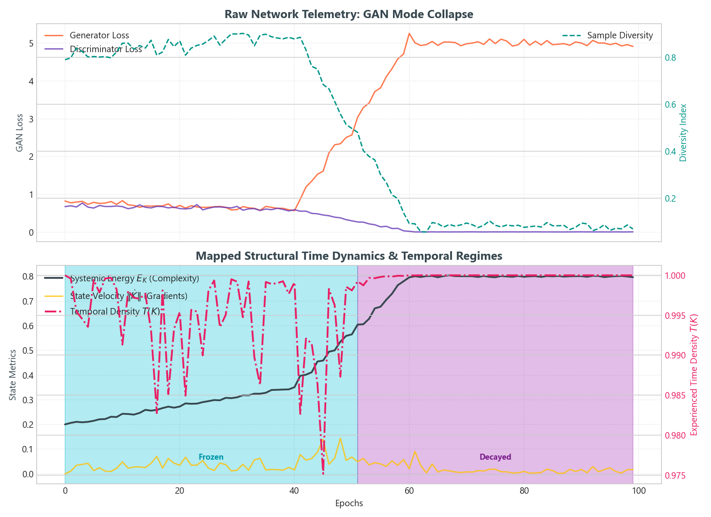
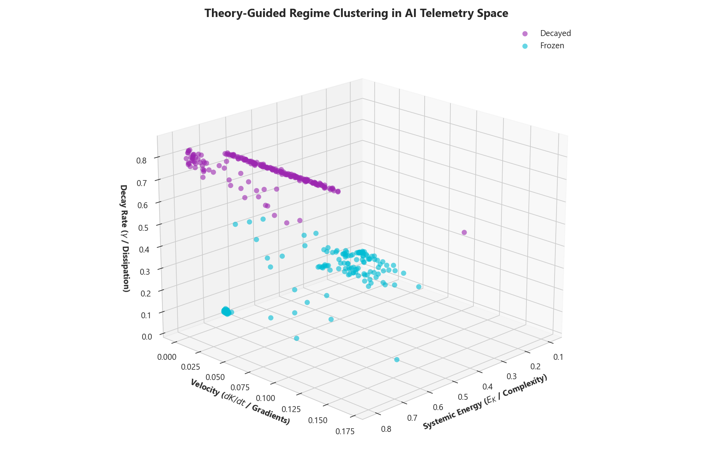

# Visualization Examples

The library comes with built-in simulation demos that generate plots of potential wells, trajectory integration, regime clustering, and AI telemetry mapping (Grokking and Mode Collapse).

To run the basic demo:
```bash
python examples/simulation_demo.py
```

To run the Deep Learning telemetry mapping demo:
```bash
python examples/nn_telemetry_demo.py
```

These will create several plots in the `examples/` directory:

---

## 1. Quartic Potential Well (`potential_well.png`)

This diagram plots the Free Energy curve:
$$\mathcal{F}(K) = a K^4 + b K^3 + c K^2 + d K$$

It automatically finds and tags critical points where $d\mathcal{F}/dK = 0$, classifying them into:
*   **Stable Equilibria (Green dots):** Valleys where the system settles (minima).
*   **Unstable Equilibria (Red dots):** Peaks representing bifurcation boundaries (maxima).



---

## 2. Gradient Flow & Experienced Time (`trajectory.png`)

This plot displays the structural state $K$ trajectory simulated using **Runge-Kutta 4th Order (RK4)** alongside the experienced temporal density $T(K)$ calculated as:
$$T_{\text{ops}} = \exp( -(\alpha \cdot \|\dot{K}\| \cdot \text{dist})^2 )$$

*   **K-State (Blue line):** Flows starting near the unstable peak (K=0.1) and smoothly settling into the stable well equilibrium (K=1.0).
*   **T(K) Experienced Time (Red line):** Approaching 1.0 at stable equilibrium (time perceived as stationary/active flow) and dropping towards 0 during rapid acceleration/displacement.



---

## 3. Theory-Guided Regime Clustering (`regime_clustering.png`)

A 3D Phase Space plot representing:
*   **X-axis:** Systemic Energy ($E_K$)
*   **Y-axis:** Velocity ($dK/dt$)
*   **Z-axis:** Decay Rate ($\gamma$)

By incorporating the structural decay coefficient ($\gamma$) as the third feature, the **TheoryGuidedClustering** (KMeans) model cleanly separates the **Frozen** and **Decayed** regimes which otherwise overlap on 2D velocity-energy projections.



---

## 4. Deep Learning Grokking Dynamics (`nn_grokking.png`)

This plot maps simulated neural network training telemetry (training/validation loss, and validation accuracy) during a **Grokking** transition into the **Core Structural Time** framework:
*   **Upper Panel:** Shows the classic "grokking" signature where training loss drops immediately, but validation accuracy remains low (Generalization Lag / Overfitting) for a long time before suddenly jumping to 100% generalization.
*   **Lower Panel:** Maps the metrics to Systemic Energy ($E_K$, representing representation complexity / weight norm), State Velocity ($\|\dot{K}\|$, representing gradients), and experienced Temporal Density $T(K)$.
*   **Shaded Regions:** Color-coded automatically by the `TheoryGuidedClustering` model, showing the transition from **Active** learning, through a long **Decayed** (overfitting) regime, a sharp **Critical** transition (grokking point), and finally a **Frozen** (stable generalized) state.



---

## 5. GAN Mode Collapse (`nn_mode_collapse.png`)

This plot displays a simulated Generative Adversarial Network (GAN) training run undergoing **Mode Collapse**:
*   **Upper Panel:** Shows the Generator Loss exploding while Discriminator Loss collapses to zero, accompanied by a sudden drop in the output diversity index.
*   **Lower Panel:** Maps this behavior to structural time dynamics, capturing the rapid transition from **Active** competition, through a highly turbulent phase, into a stagnant **Frozen** state where gradients go to zero and diversity is lost.



---

## 6. AI Telemetry 3D Regime Space (`nn_clustering_3d.png`)

A combined 3D regime space plot mapping the state coordinates of both Deep Learning simulations (Grokking and Mode Collapse):
*   Exhibits how different phases of neural network learning lie in distinct sectors of the 3D phase-space manifold ($E_K, \|\dot{K}\|, \gamma$).
*   Proves that incorporating the decay coefficient ($\gamma$) cleanly resolves the difference between the **Decayed** (overfitting with high validation loss) and **Frozen** (generalized/collapsed with low gradient velocity) states.


